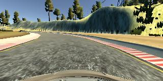
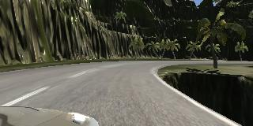

# **Behavioral Cloning** 

---

**Behavioral Cloning Project**

The goals / steps of this project are the following:
* Use the simulator to collect data of good driving behavior
* Build, a convolution neural network in Keras that predicts steering angles from images
* Train and validate the model with a training and validation set
* Test that the model successfully drives around track one without leaving the road
* Summarize the results with a written report


[//]: # (Image References)

[image0]: ./examples/model.PNG     "Keras Model"
[image1]: ./examples/easy.jpg      "Model Visualization"
[image2]: ./examples/grayscale.jpg "Grayscaling"
[image3]: ./examples/hard.jpg      "Difficult Track Image"
[image4]: ./examples/left.jpg      "Left Image"
[image5]: ./examples/center.jpg    "Center Image"
[image6]: ./examples/right.jpg     "Right Image"
[image7]: ./examples/hardFlip.jpg  "Flipped Image"


|Easy Track|Difficult Track|
|:--------:|:------------:|
|[]|[]


## Rubric Points
### Here I will consider the [rubric points](https://review.udacity.com/#!/rubrics/432/view) individually and describe how I addressed each point in my implementation.  

---
### Files Submitted & Code Quality

#### 1. Submission includes all required files and can be used to run the simulator in autonomous mode

My project includes the following files:
* model.py containing the script to create and train the model
* utils.py containing the helper functions image augmentation and model training
* drive.py for driving the car in autonomous mode
* model.h5 containing a trained convolution neural network
* examples folder containing images used in this README file
* README.md summarizing the results

#### 2. Submission includes functional code
Using the Udacity provided simulator and my drive.py file, the car can be driven autonomously around the track by executing 
```sh
python drive.py model.h5
```

#### 3. Submission code is usable and readable

The model.py and utils.py file contains the code for training and saving the convolution neural network. The file shows the pipeline I used for training and validating the model, and it contains comments to explain how the code works.

### Model Architecture and Training Strategy

#### 1. An appropriate model architecture has been employed

My model consists of a convolution neural network with mulitple filter sizes and depths between 24 and 64 (model.py lines 40-55) 

The model includes several ELU layers to introduce nonlinearity, and the data is normalized in the model using a Keras lambda layer (code line 41). 

#### 2. Attempts to reduce overfitting in the model

The model contains a dropout layer in order to reduce overfitting (model.py lines 49). 

The model was trained and validated on different data sets to ensure that the model was not overfitting. I combined the images from the easy track and the difficult track into one directory. I also trained for as few epochs as possible to avoid overfitting. Batch sizes (100) and sample sizes (1000) were also kept fairly low to avoid overfitting.

The model was tested by running it through the simulator to be sure that the vehicle could stay on the track. The simulator runs on the easy track were pretty good. The simulator run on the difficult track eventually went off the track, but was much better than my earlier runs! I think if I added more simulator runs from the difficult track to the training data my autonomous runs on the difficult track would have been better.

#### 3. Model parameter tuning

The model used an adam optimizer, so the learning rate was not tuned manually (model.py line 69).

#### 4. Appropriate training data

Training data was chosen to keep the vehicle driving on the road. I used a combination of center lane driving from the easy track and the difficult track. The critical factor was modeling good behavior, i.e. keeping my car in the middle of the road as much as possible during the simulation runs. I don't spend a lot of time with video games, so this was challenging for me. After some practice I got some decent (albeit slow) runs where my cars stayed in the middle of the road. 

In brief, training the model with erratic driving resulted in erratic autonomous driving. Training the model with center of the road driving improved results dramatically.


### Model Architecture and Training Strategy

#### 1. Solution Design Approach

The overall strategy for deriving a model architecture was to read as many GitHub solutions as possible and start with one that worked well. My model is very similar to https://github.com/naokishibuya/car-behavioral-cloning. I added some max pooling layers and changed the dimensions of some of the layers through trial and error.

To combat the overfitting, I trained for only a few epochs. In fact, I found that after only 2 epochs my model performed quite well. This was quite surprising given what I've read, but it was also a really good thing because I didn't have to wait a long time to get results.

I trained several models on just the easy track simulation data. Not surprisingly, these models failed miserably when running autonomously on the difficutl track.

The most important factor seemed to be getting good middle of the road driving simulation data. I found that no amount of model tweaking kept my autonomous runs on the road if my simulation data included me driving off the road.

At the end of the process, the vehicle is able to drive autonomously around the easy track without leaving the road, and stayed on the difficult track for quite a while.

#### 2. Final Model Architecture

The final model architecture (model.py lines 40-55) consisted of a convolution neural network with the following layers and layer sizes:

![alt text][image0]

#### 3. Creation of the Training Set & Training Process

To capture good driving behavior, I first recorded two laps on the easy track using center lane driving. Here is an example image of center lane driving:

![alt text][image1]

Here are the left, center and right camera views from the easy track:

|Left Camera|Center Camera|Right Camera|
|:----------:|:----------:|:----------:|
|![alt text][image4]|![alt text][image5]|![alt text][image6]


I collected similar sets of images from simulations on the difficult track. 

To augment the data sat, I also flipped images and angles thinking that this would ... For example, here is an image that has then been flipped:


|Original|Flipped|
|:----------:|:----------:|
|![alt text][image3]|![alt text][image7]


Etc ....

After the collection process, I had X number of data points. I then preprocessed this data by ...


I finally randomly shuffled the data set and put Y% of the data into a validation set. 

I used this training data for training the model. The validation set helped determine if the model was over or under fitting. The ideal number of epochs was Z as evidenced by ... I used an adam optimizer so that manually training the learning rate wasn't necessary.
